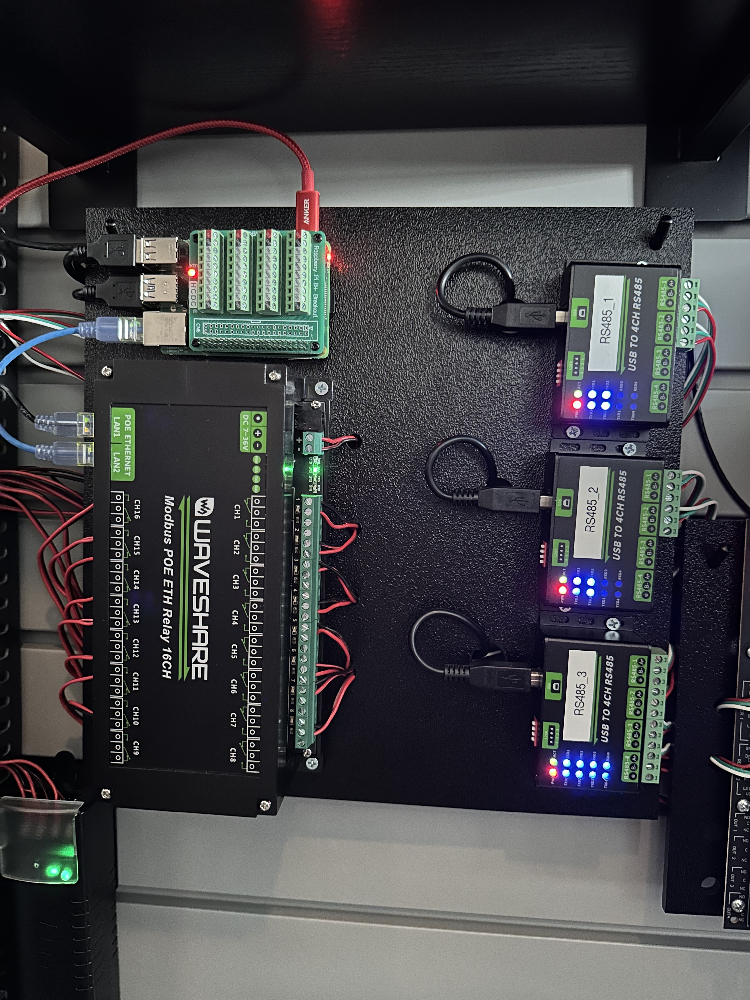

# DoorSim

DoorSim is a Blazor WebAssembly (hosted) application that runs on a Raspberry
Pi and simulates physical access-control readers and doors for testing panel
integrations without real hardware on the bench.

It answers panel polls as an OSDP peripheral device (PD) over
USB→RS-485 adapters, or emits Wiegand card data over GPIO, and drives door
position switch (DPS) / request-to-exit (REX) contacts through a Modbus TCP
relay board. A web UI manages a card library and door configuration, and
triggers card reads and door lifecycle events per reader.

## Features

- **OSDP** (PD role) over USB→quad-RS-485 adapters, with per-door baud rate
  and secure-channel support
- **Wiegand** card data over GPIO, still supported per door alongside OSDP
- **Modbus TCP** relay control for DPS/REX contacts
- Reader/door count is driven entirely by what's configured in the database
  — not a fixed pin table
- A web UI (Blazor WASM) for managing the card library, door configuration,
  and firing simulation events (card read, access cycle, egress cycle)
- A REST API as the integration point for the web UI today, and for future
  clients (e.g. a desktop app) that want to drive the same simulator

## Advanced OSDP settings

Each OSDP door has an **Advanced OSDP** tab in its edit dialog that controls the
PD personality the simulator presents to the panel.

**These settings change only what the PD *declares*. They do not change what
DoorSim actually does.** Declaring a capability the simulator doesn't implement
is deliberate — it's how you test what a panel does when a reader claims
something it can't back up. Leave a field blank to use the simulator default.

Three groups:

- **Advertised capabilities (`osdp_CAP`)** — the compliance level and declared
  count for each capability. Out of the box DoorSim advertises only card data
  format, reader LED control, check-character support and communication
  security. Contact status monitoring, output control, audible output and text
  output are all implemented but unadvertised, so a panel that gates on
  `osdp_CAP` never exercises them; declare them here to turn that on. Buffer
  sizes, OSDP version and downstream reader count are declaration-only.
- **Device identity (`osdp_ID`)** — vendor code, model number, hardware
  version, serial number and firmware version, for impersonating a specific
  vendor's reader. The serial number is also used as the connection cUID.
- **Protocol behaviour & timing** — the reply to a vendor-specific `osdp_MFG`
  command, the reply to an `osdp_COMSET` address change, and per-door
  connection and reply timeouts.

Two settings deserve specific warning:

- **Check-character support level 0** declares "checksum only, no CRC-16", but
  DoorSim's framing is decided by the incoming message, not by this
  declaration. A panel that honours it may switch to checksum framing and the
  link will go silent — which looks like a wiring fault, not a config choice.
- **AES-128** is declaration only. DoorSim keeps `RequireSecurity = false` and
  has no SCBK, so it will not negotiate a secure channel no matter what these
  bits say.

Accepting an `osdp_COMSET` address change takes effect on the *next* connection
(OSDP.Net updates its device configuration from the reply and the connection
loop re-reads it), the requested baud rate is echoed back but never applied
because the listener isn't restarted, and the stored door configuration is not
updated — so reconcile it by hand. The warning logged on accept names the old
and new address.

Doors with any non-default advanced setting are flagged in the **Adv** column of
the door configuration table.

## Tech stack

- .NET 10, C#
- ASP.NET Core / Kestrel (server host)
- Blazor WebAssembly Hosted (`DoorSim.Client` served by the `DoorSim` server)
- `System.Device.Gpio` for Wiegand/GPIO on the Pi
- A vendored, patched fork of [OSDP.Net](https://github.com/Z-bit-Systems-LLC/OSDP.Net)
  for the OSDP protocol implementation (see
  [source/src/OSDP.Net/NOTICE.md](source/src/OSDP.Net/NOTICE.md))
- EF Core + SQLite for card library and door configuration persistence
- Target runtime: `linux-arm64` (Raspberry Pi OS, 64-bit)

## Hardware

The reference deployment runs on a Raspberry Pi 4, with OSDP readers on
USB→4-channel RS-485 adapters (one per bank of up to 4 doors — see
`scripts/99-waveshare485.rules`) and DPS/REX contacts on a Waveshare
16-channel Modbus PoE Ethernet relay — no direct GPIO wiring required for
either. A GPIO breakout board and a plastic sheet base keep everything
mounted and accessible on the bench.

- [USB to 4-Channel RS-485 Adapter](https://a.co/d/0enTJAQv)
- [Waveshare 16-Ch Modbus PoE Ethernet Relay](https://a.co/d/06AuJav3)
- [Raspberry Pi 4](https://a.co/d/0aqPO5tJ)
- [GPIO Breakout Board](https://a.co/d/01OrxglH)
- 12x12 plastic sheet (bench mounting base)

Wiegand-GPIO-direct wiring (level shifters + relay modules straight to the
Pi's GPIO header) is still supported per door as an alternative — see
[docs/WIRING_GUIDE.md](docs/WIRING_GUIDE.md) and
[docs/WIRING_QUICK_REFERENCE.md](docs/WIRING_QUICK_REFERENCE.md) if you're
wiring a door that way instead.

For standing up a Raspberry Pi from scratch or deploying to an existing one,
see [docs/PI_SETUP.md](docs/PI_SETUP.md). For adding or diagnosing a
USB→RS-485 adapter, see [docs/RS485_ADAPTERS.md](docs/RS485_ADAPTERS.md).

## License

MIT — see [LICENSE](LICENSE). The vendored OSDP.Net fork under
`source/src/OSDP.Net/` is separately licensed under Apache-2.0; see
[source/src/OSDP.Net/LICENSE.txt](source/src/OSDP.Net/LICENSE.txt) and
[source/src/OSDP.Net/NOTICE.md](source/src/OSDP.Net/NOTICE.md).
