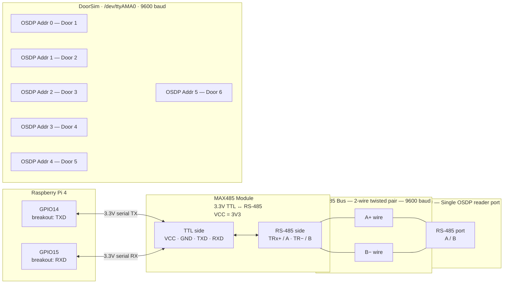
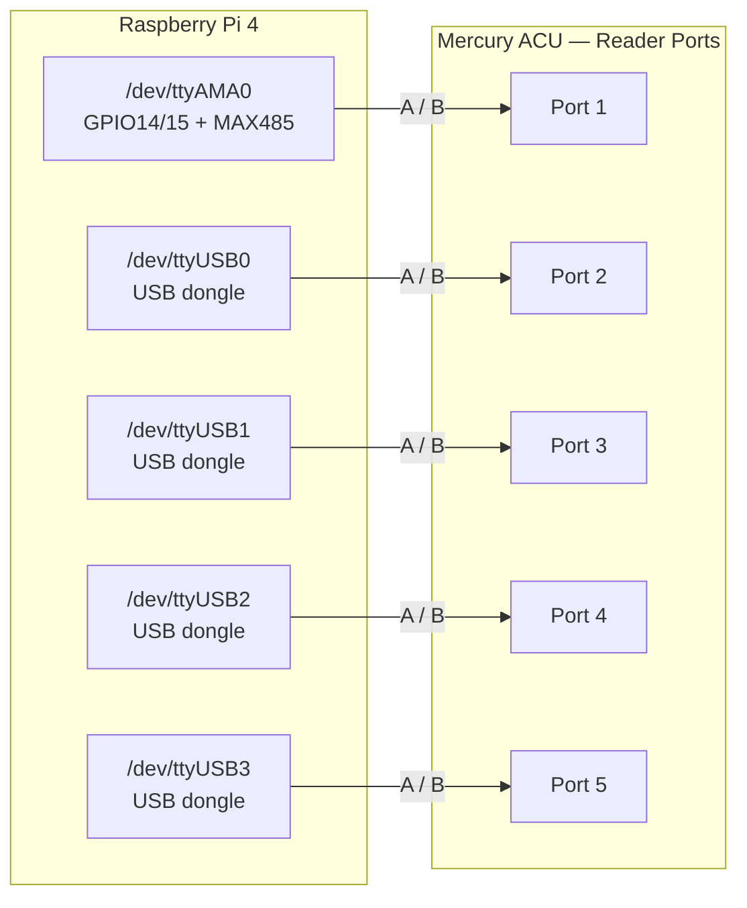
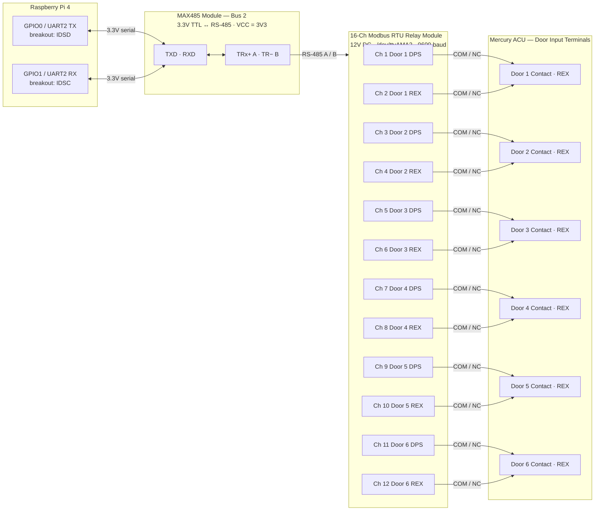

# DoorSim Wiring Diagrams

These diagrams cover the **default rig**: OSDP over RS-485 for card reads,
with DPS/REX on a Modbus relay board. For the alternative per-door path —
`Protocol: Wiegand` wired straight to GPIO, with DPS/REX also on GPIO
instead of the Modbus board — see
[WIRING_GUIDE.md](WIRING_GUIDE.md) (full guide) or
[WIRING_QUICK_REFERENCE.md](WIRING_QUICK_REFERENCE.md) (printable card).

---

## OSDP RS-485 — Single ACU Reader Port, Multi-Drop

All simulated OSDP readers share **one RS-485 segment** on a single ACU reader port.
Each door is assigned a unique OSDP address (0–5). The Pi is the OSDP slave;
the Mercury ACU reader port is the master that polls each address.

### MAX485 pin connections

| MAX485 pin  | Connect to                    |
|-------------|-------------------------------|
| VCC         | 3V3 (breakout block 2)        |
| GND         | GND (breakout block 2)        |
| TXD         | TXD terminal (GPIO14)         |
| RXD         | RXD terminal (GPIO15)         |
| TRx+ / A    | Mercury ACU RS-485 A          |
| TR− / B     | Mercury ACU RS-485 B          |

> **Label note:** Some modules mark the RS-485 side `A+/B−` or `TRx+/TR−` — these are equivalent.
> If OSDP never connects, swap the A and B wires at the ACU port.

---

## OSDP RS-485 — Multiple ACU Reader Ports

Use one USB-to-RS485 dongle per ACU reader port. Each dongle is an independent
RS-485 segment — no address conflicts. Each door configured with OSDP address 0.

> The onboard UART (`/dev/ttyAMA0`) handles one port; USB dongles handle the rest.
> Each DoorSim door entry gets its own **Serial Port** value and **OSDP Address 0**.

---

## Modbus RS-485 — 16-Channel Relay Module (DPS / REX)

DPS and REX contacts for all 6 doors are driven by a single 16-channel DC 12V Modbus RTU
relay module on Bus 2. UART2 (GPIO0/1 → `/dev/ttyAMA2`) connects via a second MAX485 module.

### MAX485 Bus 2 pin connections

| MAX485 pin  | Connect to                                      |
|-------------|-------------------------------------------------|
| VCC         | 3V3                                             |
| GND         | GND                                             |
| TXD         | **IDSD** terminal (GPIO0 / UART2 TX) — Block 3 |
| RXD         | **IDSC** terminal (GPIO1 / UART2 RX) — Block 3 |
| DE + RE     | **GPIO2** (physical pin 3) — direction control  |
| TRx+ / A    | Relay module RS-485 A                           |
| TR− / B     | Relay module RS-485 B                           |

> **DE/RE wiring:** Tie `DE` and `RE` together on the MAX485 module and connect to **GPIO2**.
> HIGH = transmit, LOW = receive. Set `"Modbus": { "DeRePinBcm": 2 }` in `appsettings.json`.

> **Relay wiring:** Use **COM** and **NC** on each relay.
> NC closed (relay off) = contact closed = door closed / no REX.
> NC open (relay on) = contact open = door open / REX active.
